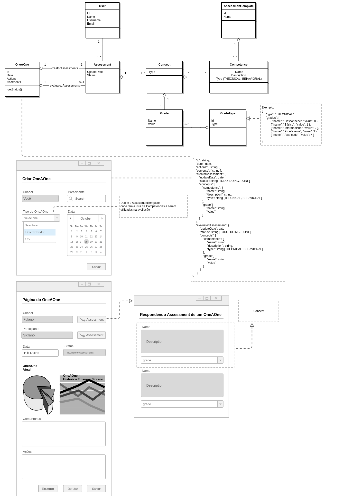

#Professional Assessment API

---

### 1. Introdução

Essa aplicação visa prover uma forma de acompanhar o crescimento profissional de membros de um time.



---

### 2. Tecnologias

- SpringBoot - Java 11;

---

### 3. Instalação de componentes básicos

1. Instalar o SDKMAN

    ```
    $ curl -s "https://get.sdkman.io" | bash
    $ source "$HOME/.sdkman/bin/sdkman-init.sh"
    $ sdk version
    ```

2. Instalar e usar o Java 8:

    ```
    $ sdk list java
    $ sdk use java 8.0.222-zulu
    ```

3. ( Se não for rodar pelo Intellij ) Instalar e usar o Gradle:

    ```
    $ sdk use gradle 6.3
    ```

4. [OPCIONAL] Instalar a IDE do Intellij e o Lombok Plugin

    4.1 Instalar o [Intellij](https://www.jetbrains.com/idea/);
    
    4.2 Abrir Intellij, ir para o menu de plugins (File > Settings... > Plugins) e instalar o Lombok;
    
    4.3 Após reiniciar clique no menu: File > Settings... > Build, Execution, Deployment >
   Compiler > Annotation Processors e marque o checkbox "Enable Annotation Processing";

---

### 5. Executanto a aplicação

```
$ gradle bootRun
```

---

### 6. Single-sign on github

A aplicação permite o login de qualquer usuário do github que pertença a organização AmeDigital. 
Para isso, a organização deve estar com visibilidade publica no profile do usuário.

https://docs.github.com/en/github/setting-up-and-managing-your-github-user-account/publicizing-or-hiding-organization-membership

---

### 7. Swagger

1. UI

    http://localhost:8080/swagger-ui/index.html#/

2. Links uteis

    https://springfox.github.io/springfox/docs/current/#springfox-spring-mvc-and-spring-boot

    https://medium.com/@hala3k/setting-up-swagger-3-with-spring-boot-2-a7c1c3151545

    http://localhost:8080/swagger-resources/configuration/ui

    http://localhost:8080/swagger-resources

    http://localhost:8080/v3/api-docs
